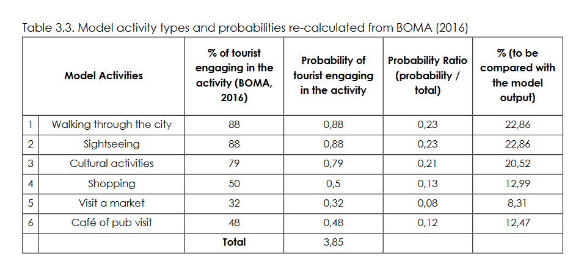
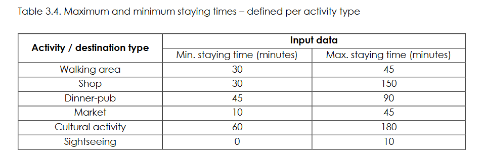

# The Tourist module

Tourist agents move between locations in the city centre of Amsterdam. They have a base location (a hotel, B&B or AirBnB) from which they leave and return. In between they perform specifies activities by visiting specific attractions.  
Tourist agents have a specific time budget based on their leaving and return time. Within the time budget, tourist agent visit one or several attractions. Tourist agents differ in their preference for activities; some prefer cultural activities other shopping. The tourist activities consist of six different options. Each of the activities has a number of tourist attractions linked to it. For instance, a cultural activity includes attractions: Rijksmuseum, van Gogh museum, Anne frank etc. At the start of the simulation, the tourist agent population has an activity division based on available statistics (see table 3.3 Julia). 
The basis of the 

## Tourist Activities
Six activity types (out of twelve addressed in BOMA) are selected to be included in the model (Julia p.33) \
1-	Walking through the city \
2-	Sightseeing \
3-	Cultural activity (museum, art exhibition, zoo etc) \
4-	Shopping \
5-	Visit a market \
6-	Cafe or pub visit 

## Tourist attraction
The model contains a list of tourist attractions (take form Julia). All tourist attractions have an attractiveness score related to the number of visitors relative to the capacity of the attraction and the relative number of visitors that visits them. Tourists do not repeat visiting a tourist attraction. Vicinity to the tourist attraction should also be taken into account.. (not sure if or how Julia did this).

## Network
Some street in the network have a higher attractiveness score than others for their scenic quality for instance. These streets are the ones coloured on the tourist maps of Amsterdam.

## Decisions 

Tourist agents make two decisions: 1) What to do, and 2) How to get there.

1)	What to do:
The tourist agent uses the original CONSUMAT approach (so without memory) to select what to do. This makes sense as they have not made the decision before. Choosing the original CONSUMAT will save computation time and can be justified by the lack of previous experiences. Agents select the attraction with the highest score
When calculating the satisfaction level and uncertainty levels, the agent calculates:
-	Existence need – here relates to attractiveness score of tourist attractions
-	Personal need – here relates to the personal preference for a specific activity type
-	Social need – here relates to agents own choice and that of its peers. Hereby, the agents desires to be similar in activity choice, but better in attractiveness score of selected activity than its peers

2)	How to get there:
The tourist agent travel decision is similar to that of the inhabitant, only that it does not rely on memory. It’ll be based on the original CONSUMAT approach. The choice of travel mode includes: \
1	Walk shortest distance \
2	Walk most scenic route  \
3	Public transport 

These options are evaluated for their the time it takes in relation to the average time of all options.(?)

## Inputs are

Proportion of people for each activity

Staying time at each activity

